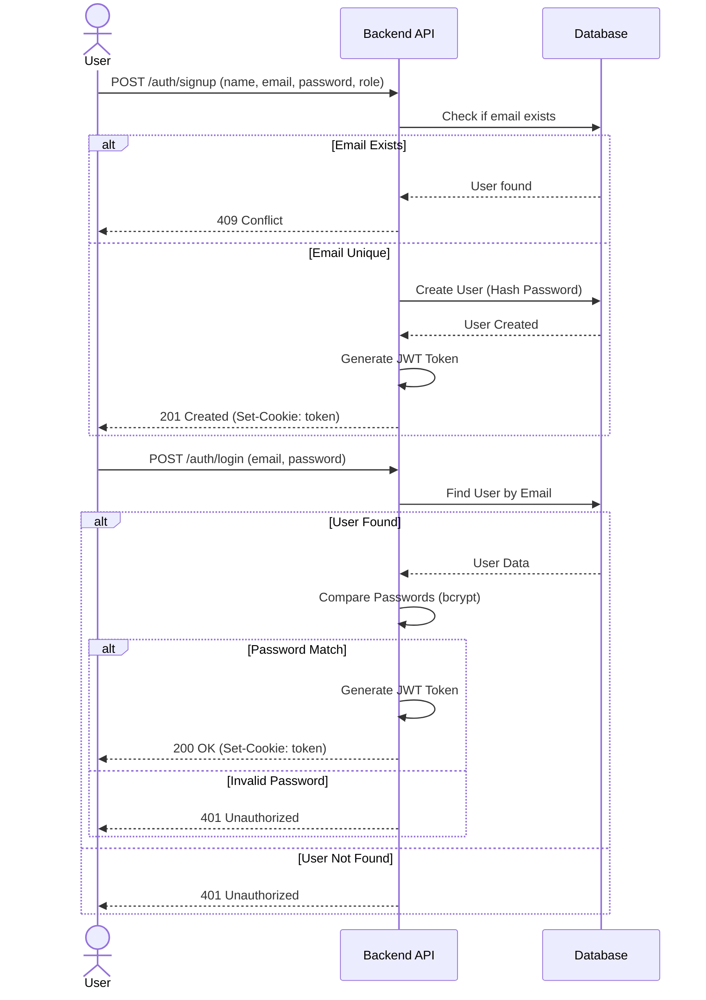

# Project Flowchart & Architecture

This document maps out the flow of the Attendance and Leave System based on the current backend architecture. You can view these diagrams in VS Code (using the Mermaid extension) or copy the code into the [Mermaid Live Editor](https://mermaid.live/).

## 1. High-Level Architecture

This diagram shows how the main components of the system interact.

## 2. User Authentication Flow

This flow details the Signup and Login process.

## 3. Student Workflow

This flowchart shows the actions available to a user with the **Student** role.

## 4. Admin Workflow

This flowchart shows the actions available to a user with the **Admin** role.

